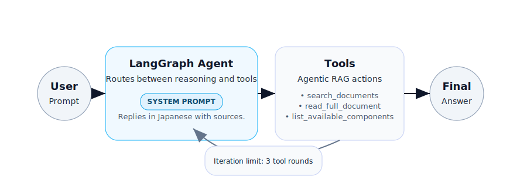

# Autoware Documentation Q&A Agent

Agentic RAG demo built with LangGraph and Chroma to answer Autoware questions in Japanese.

## Get Started
```bash
python -m venv .venv
source .venv/bin/activate
pip install -r requirements.txt
export OPENAI_API_KEY="sk-..."
```

## Run a Demo Question
```bash
python main.py --trace --question "Autoware の Planning コンポーネントについて教えてください"
```

Visualizer (optional):
```bash
python visualize_agent.py --format mermaid --output agent_flow.mmd
```
Static snapshot:


